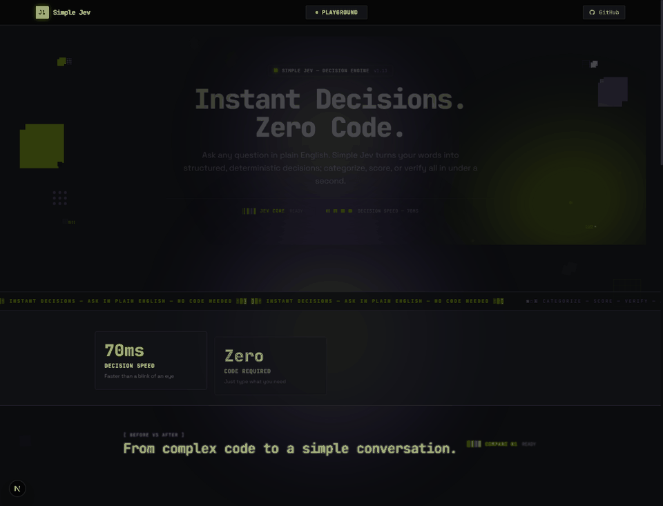

# Conversational Jev (Simple Jev)

<p align="center">
  <strong>The No-Code Conversational Layer for TypeSafe AI's Jev Model</strong><br>
  <em>Turn plain English intent into validated, deterministic System 1 decisions in milliseconds — without writing a single line of JSON schema.</em>
</p>

<p align="center">
  <a href="https://simplejev.pages.dev"></a>
  <a href="https://simplejev.pages.dev/playground"></a>
  <a href="https://github.com/ihatecoding01/Conversational-Jev"></a>
</p>

<p align="center">
  
  
  
  
  
  
  
  
</p>

---

## 1. The Problem: Deterministic Decisions Shouldn't Require Writing JSON

TypeSafe AI's **Jev** is a breakthrough **System 1 decision model**: sub-100ms, strictly typed, deterministic, and free of autoregressive hallucination across discrete choices (`Choice`), numeric scores (`Score`), and boolean assertions (`Noul`).

**The catch?** Jev is an engine, not an interface. To use raw Jev today, an engineer must:
1. Manually craft a formal JSON question schema and `state` payload.
2. Ensure strict mutual exclusivity, valid option sizing, and semantic coverage by hand.
3. Write custom API glue code, handle validation rejections, and build UI abstractions from scratch.

This makes raw Jev inaccessible to support operators, product managers, and citizen developers, while forcing engineers into tedious schema-maintenance cycles.

| Dimension | Raw Jev Approach | Conversational Jev (Simple Jev) |
|---|---|---|
| **Authoring Input** | Hand-coded `{state, schema}` JSON definitions | Free-form natural language intent |
| **Time to Decision** | 10 to 15 minutes of schema authoring & testing | **< 100 milliseconds** end-to-end |
| **Schema Validation** | Manual trial-and-error or silent runtime errors | Automated **5-point meta-schema validator** with diff patching |
| **User Exposure** | Raw brackets, braces, and typed payloads | **Zero raw JSON**. Plain English sentences & interactive chips |
| **Option Editing** | Edit JSON code block, re-deploy, re-invoke LLM | Click `✕` or `+ Add Option` with **zero-cost instant re-validation** |
| **Cost & Latency** | Full token overhead on every query | 384-dim semantic cache ($\ge 0.95$ similarity) executes **free at 0 credits** |

> **Core Philosophy**: Zero Raw JSON Exposure. The LLM translates intent into candidate schemas; Jev executes the actual decision deterministically.

---

## 2. 15-Second Demo Walkthrough

Watch Conversational Jev translate an unstructured customer request into a validated, deterministic routing decision:

<p align="center">
  
</p>

### Try It Live in Production
- 🚀 **Main Application**: [https://simplejev.pages.dev](https://simplejev.pages.dev)
- 🧪 **Interactive Studio & Playground**: [https://simplejev.pages.dev/playground](https://simplejev.pages.dev/playground)

### What Happens in Those 15 Seconds:
1. **User Types Plain English**: *"Route this customer complaint: 'My credit card was charged twice for the annual tier' into billing, technical support, or account setup."*
2. **Intent Parsing & 5-Point Validation**: Simple Jev parses the state, verifies mutual exclusivity, coverage, and type fit in the background.
3. **"What I Understood" Confirmation Card**: Shows plain-language summary with interactive visual chips. Edit or delete options instantly with zero LLM re-invocation costs.
4. **Deterministic Verdict Card**: Delivers the final Jev decision (*"Billing & Invoicing"*, 98% certainty, 74ms execution latency) with a collapsible probability distribution breakdown.

---

## 3. Quickstart: Up and Running in One Command

You can run Simple Jev locally in under 60 seconds. **Zero external API keys are required to test** — the system boots into high-fidelity deterministic simulation mode out of the box.

### Option A: Docker Compose (Recommended)

```bash
# Clone the repository
git clone https://github.com/ihatecoding01/Conversational-Jev.git
cd Conversational-Jev

# Start both backend and frontend containers
docker compose up
```

Open **[http://localhost:3000](http://localhost:3000)** in your browser!
- Frontend UI: `http://localhost:3000`
- FastAPI Backend & Swagger Docs: `http://localhost:8000/docs`

---

### Option B: Local Development (Hot-Reload)

```bash
# Clone and enter repo
git clone https://github.com/ihatecoding01/Conversational-Jev.git
cd Conversational-Jev

# 1. Install & launch Python backend (Port 8000)
pip install -r backend/requirements.txt
python backend/run.py

# 2. In a second terminal, install & launch Next.js frontend (Port 3000)
cd frontend
npm install
npm run dev
```

### Optional: Connecting Live API Keys

To switch from simulation mode to live production models, populate `backend/.env`:

```ini
# Optional: TypeSafe AI Live Jev API Key
JEV_API_KEY=your_typesafe_jev_key_here
JEV_API_URL=https://api.typesafe.ai/v1

# Optional: LLM Provider for cold intent generation ("mock", "gemini", "groq", "openai")
LLM_PROVIDER=gemini
GEMINI_API_KEY=your_gemini_key_here

# Semantic Caching & Rate Limiting Thresholds
CACHE_SIMILARITY_THRESHOLD=0.85
EXACT_CACHE_THRESHOLD=0.95
DAILY_INQUIRY_LIMIT=25
```

---

## 4. System Architecture

Simple Jev operates as a resilient five-stage pipeline designed to protect Jev's determinism while completely shielding the user from technical schema mechanics.

```mermaid
flowchart TD
    User([User Prompt: Plain English]) --> Security[Prompt Injection Barrier & Sanitizer]
    Security --> Cache{Intent Vector Cache<br/>384-dim all-MiniLM-L6-v2}

    %% Exact Cache Hit Path
    Cache -- "Exact Hit (>= 0.95 Sim) & Unrestricted Mode" --> FastExec[Jev System 1 Execution]
    
    %% Cache Miss or Divergence Path
    Cache -- "Cold Miss or Restricted Mode" --> Generator[Generator Engine<br/>Extracts Candidate Schema & State]
    
    Generator --> Validator{5-Point Meta-Validator<br/>Coverage | Exclusivity | Type Fit<br/>Scope | State Sufficiency}
    
    %% Validation Failure Loop
    Validator -- "Fails Criteria" --> Patcher[Targeted Diff Patcher<br/>Surgical Field Repair]
    Patcher -- "Stall Cycle Detected (2 Retries)" --> Fallback[Graceful Plain Conversational Fallback]
    Patcher -- "Repaired Schema" --> Validator
    
    %% Validation Success Path
    Validator -- "Passes All Checks" --> ConfirmCard["What I Understood" Card<br/>Interactive Visual Chips]
    
    %% User Chip Edits
    ConfirmCard -- "User Modifies Chips (Add/Remove)" --> FastReval["Local Fast Re-Validation<br/>(Zero LLM Token Cost)"]
    FastReval --> ConfirmCard
    
    %% User Confirmation / Auto-run
    ConfirmCard -- "Confirm & Run" --> FastExec
    
    %% Execution to Verdict
    FastExec --> Verdict["Deterministic Decision Card<br/>Certainty % + Latency + Probability Distribution"]
    FastExec -.-> CacheStore[(Update Semantic Cache)]
```

### The 5-Point Meta-Schema Contract

The Validator is not an answer engine; it is a **meta-evaluator** that audits candidate schemas across 5 dimensions before execution:

| Check | Primitive Evaluated | Verification Objective | Failure Response |
|---|---|---|---|
| **1. Semantic Coverage** | `Choice` (`complete`, `missing_option`, `unsure`) | Ensures the generated options span realistic user scenarios without blind spots. | Patcher inserts missing domain categories. |
| **2. Mutual Exclusivity** | `Noul` (Boolean) | Detects overlapping or redundant choices (e.g., separating "Billing" and "Payment Error"). | Patcher collapses overlapping categories into distinct buckets. |
| **3. Question Type Fit** | `Choice` (`correct_type`, `should_be_choice`, `should_be_score`, `should_be_noul`) | Guarantees the appropriate Jev primitive is selected for the user's intent. | Patcher converts between `Choice`, `Score`, and `Noul`. |
| **4. Scope / Sizing** | `Choice` (`well_formed`, `too_broad`, `too_narrow`) | Enforces optimal choice counts (typically 2 to 6 options) to prevent cognitive bloat. | Patcher trims peripheral or out-of-scope options. |
| **5. State Sufficiency** | `Noul` (Boolean) | Verifies the extracted context contains enough factual signal to answer the question. | Prompts user for missing contextual parameters. |

---

## 5. Architectural Invariants & Key Capabilities

1. **Zero Raw JSON Exposure**:
   The user never interacts with raw brackets or JSON schemas. All internal schemas are deterministically rendered into natural sentences (*"I will sort this inquiry into one of: Billing, Technical Support, or Account Management. Sound right?"*).

2. **Zero-Cost Local Chip Re-Validation**:
   When users tweak choices via interactive chips (`✕` to delete, `+ Add Option` to insert), the frontend calls `POST /api/v1/schema/revalidate`. This recalculates coverage deterministically in Python **without invoking the Generator LLM**, saving latency and preserving user quota.

3. **Restricted vs. Unrestricted Safety Modes**:
   - **Restricted Mode (Default)**: Pauses at the confirmation card on every pass. Ideal for high-stakes audits or sensitive operations.
   - **Unrestricted Mode**: Automatically executes high-confidence cache hits ($\ge 0.95$ similarity) straight through in milliseconds. Novel intents or structural mutations always pause for explicit user sign-off.

4. **Progressive Trust Milestone**:
   When a user confirms candidate schemas $N \ge 3$ consecutive times without manual chip modifications, a dismissible banner invites them to enable Unrestricted Mode for automated straight-through execution.

5. **Schema Divergence Delta Alerts**:
   If an approved workflow mutates (e.g. an extra option is generated), an amber prompt highlights the exact delta: *"Previous options: [Billing, Support, Account]. New option detected: [Refunds]. Include it?"*

6. **Pinned Schemas & Instant Quick Run**:
   Save recurring decision patterns (e.g., *"Customer Email Router"*, *"Ticket Urgency Scorer"*) to the sidebar library. Click **Quick Run** to test raw text directly against fixed schemas at zero credit cost.

---

## 6. Repository Layout

```
Conversational-Jev/
├── backend/
│   ├── app/
│   │   ├── cache/
│   │   │   └── intent_cache.py       # 384-dim normalized vector index + failure history
│   │   ├── models/
│   │   │   ├── api_types.py          # Request & Response DTOs (Pydantic v2)
│   │   │   └── jev_types.py          # Core primitives (Choice, Score, Noul, FitnessReport)
│   │   ├── services/
│   │   │   ├── embedder.py           # sentence-transformers (all-MiniLM-L6-v2)
│   │   │   ├── executor.py           # TypeSafe Jev API client + deterministic simulation engine
│   │   │   ├── generator.py          # LLM intent parsing & plain-language translation
│   │   │   ├── patcher.py            # Surgical diff repair & stall cycle detection
│   │   │   ├── rate_limiter.py       # IP/fingerprint daily inquiry bucket
│   │   │   ├── security.py           # Prompt injection sanitization barrier
│   │   │   └── validator.py          # 5-point meta-schema evaluator
│   │   ├── config.py                 # Pydantic Settings reading .env
│   │   ├── main.py                   # FastAPI routes & CORS
│   │   └── tests/                    # Unit test suite
│   ├── Dockerfile                    # Containerization for backend
│   ├── requirements.txt              # Python dependencies
│   ├── run.py                        # Server launcher
│   └── test_runner.py                # Zero-dependency test execution script
├── frontend/
│   ├── src/
│   │   ├── app/
│   │   │   ├── layout.tsx            # Root layout & SEO meta tags
│   │   │   ├── page.tsx              # Main conversational canvas & state orchestrator
│   │   │   ├── playground/page.tsx   # Studio playground page
│   │   │   └── globals.css           # Tailwind CSS styling & animations
│   │   ├── components/
│   │   │   ├── ConfirmationCard.tsx  # "What I Understood" card with interactive chips
│   │   │   ├── DecisionCard.tsx      # Verdict card with probability breakdown drawer
│   │   │   ├── DeltaPrompt.tsx       # Schema divergence amber alert
│   │   │   ├── Header.tsx            # Mode switcher, usage meter, engine indicator
│   │   │   ├── InputBar.tsx          # Sticky natural language input bar
│   │   │   ├── ProgressiveTrustBanner.tsx # Milestone banner for N >= 3 unedited runs
│   │   │   ├── Sidebar.tsx           # Pinned rules library & Quick Run trigger
│   │   │   └── Stepper.tsx           # Dynamic animated progress stepper
│   │   ├── services/
│   │   │   ├── api.ts                # Typed backend API client
│   │   │   └── storage.ts            # LocalStorage persistence manager
│   │   └── types/
│   │       └── index.ts              # Shared TypeScript interfaces
│   ├── Dockerfile                    # Containerization for frontend
│   ├── next.config.ts                # API proxy rewrites
│   ├── package.json
│   └── tsconfig.json
├── docker-compose.yml                # One-command orchestration
├── docs/
│   └── assets/
│       └── demo.gif                  # Real 15-second animated demonstration
├── Architecture.md                   # Full architectural specification
├── PRD.md                            # Comprehensive Product Requirements Document
├── AGENTS.md                         # Coding agent guidelines & invariant rules
└── README.md                         # This document
```

---

## 7. Testing & Verification

Every pull request and build must pass both verification protocols:

### 1. Backend Test Suite (12 Comprehensive Tests)
```bash
python backend/test_runner.py
```
```
============================================================
RUNNING BACKEND TEST SUITE
============================================================
  [PASS] test_validator_passes_well_formed_schema
  [PASS] test_validator_fails_incomplete_state
  [PASS] test_validator_catches_overlapping_options
  [PASS] test_validator_catches_type_mismatch
  [PASS] test_patcher_resolves_type_mismatch
  [PASS] test_patcher_stall_detection
  [PASS] test_root_endpoint
  [PASS] test_cache_hit_restricted_mode
  [PASS] test_cache_hit_unrestricted_mode_auto_executes
  [PASS] test_cold_miss_evaluation
  [PASS] test_instant_chip_revalidate
  [PASS] test_execute_jev_decision
============================================================
TOTAL: 12 | PASSED: 12 | FAILED: 0
============================================================
```

### 2. Frontend Production Build
```bash
cd frontend
npm run build
```
Ensures 0 TypeScript errors, 0 ESLint warnings, and valid Turbopack static compilation.

---

## 8. License

Distributed under the **MIT License**. See [`LICENSE`](LICENSE) for details.
